# Système de Gestion de Réservation de Salles

Une application web de gestion de réservations de salles développée avec Spring Boot et JSP.

## Membres du Groupe

- **AVALLA Onésime** 
- **AZONNOUDO Junior**


## Structure du Projet

Ce projet suit l'architecture MVC (Modèle-Vue-Contrôleur) :

### 1. **Entités** (`src/main/java/com/example/reservation/Entities/`)

Toutes les tables de la base de données sont déclarées comme entités JPA dans ce package. Chaque entité représente une table dans la base de données PostgreSQL avec les relations et mappings appropriés.

**Entités :**
- `Utilisateur.java` - Représente les utilisateurs du système
- `Salle.java` - Représente les salles disponibles pour réservation
- `Reservation.java` - Représente les réservations effectuées par les utilisateurs

### 2. **Repositories** (`src/main/java/com/example/reservation/Repositories/`)

Chaque entité possède une interface repository correspondante qui étend `JpaRepository`, fournissant les opérations CRUD standard et des méthodes de requête personnalisées.

**Repositories :**
- `UtilisateurRepository.java`
- `SalleRepository.java`
- `ReservationRepository.java`

### 3. **Services** (`src/main/java/com/example/reservation/Services/`)

La couche service contient la logique métier et orchestre les opérations en utilisant les repositories. Toutes les actions CRUD et règles métier sont implémentées ici.

**Services :**
- `UtilisateurService.java` - Opérations de gestion des utilisateurs
- `SalleService.java` - Gestion des salles et vérification de disponibilité
- `ReservationService.java` - Création, modification et suppression de réservations

### 4. **Couche Contrôleurs** (`src/main/java/com/example/reservation/controllers/`)

Les contrôleurs gèrent les requêtes HTTP, interagissent avec les services pour traiter les données, et servent les vues JSP avec les données nécessaires pour la visualisation.

**Contrôleurs :**
- `HomeController.java` - Navigation de la page d'accueil
- `UtilisateurController.java` - Points d'accès pour la gestion des utilisateurs
- `SalleController.java` - Points d'accès pour la gestion des salles
- `ReservationController.java` - Points d'accès pour la gestion des réservations

### 5. **Vues** (`src/main/webapp/WEB-INF/jsp/`)

Pages JSP pour l'interface utilisateur, avec des composants de template réutilisables.

**Templates :**
- `layouts/header.jsp` - En-tête HTML et styles communs
- `layouts/navbar.jsp` - Barre de navigation (utilisée sur toutes les pages)
- `layouts/footer.jsp` - Section pied de page

**Pages :**
- `home.jsp` - Tableau de bord principal
- `utilisateurs.jsp` - Page de gestion des utilisateurs
- `salles.jsp` - Page de gestion des salles
- `reservations.jsp` - Page de gestion des réservations

## Fonctionnalités de l'Application

### Page d'Accueil
Tableau de bord d'accès rapide offrant une navigation vers toutes les sections principales de l'application.

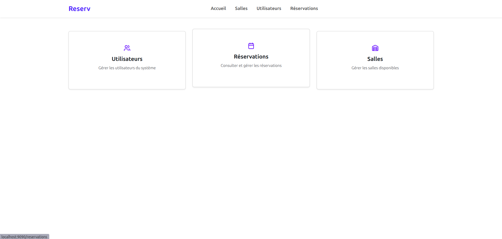

---

### Gestion des Utilisateurs

Interface complète de gestion des utilisateurs pour créer et gérer les utilisateurs du système.

**Fonctionnalités :**
- Visualiser tous les utilisateurs enregistrés dans un tableau
- Créer de nouveaux utilisateurs avec attribution de rôle (Administrateur ou Utilisateur)
- Modifier les informations des utilisateurs existants
- Supprimer des utilisateurs du système


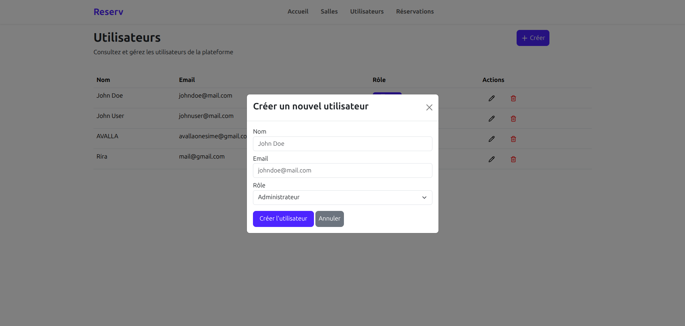

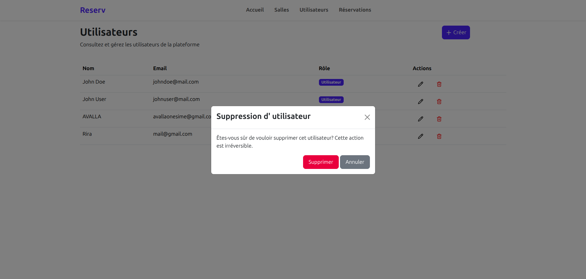

---

### Gestion des Salles

Gérer toutes les salles disponibles dans le système.

**Fonctionnalités :**
- Visualiser toutes les salles avec leurs détails (nom, capacité, localisation, disponibilité)
- Créer de nouvelles salles
- Modifier les informations des salles
- Supprimer des salles

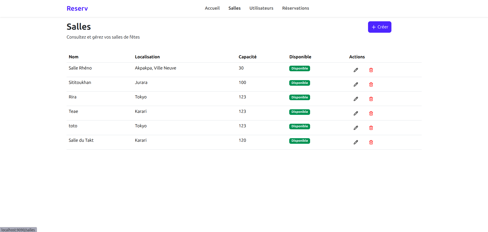
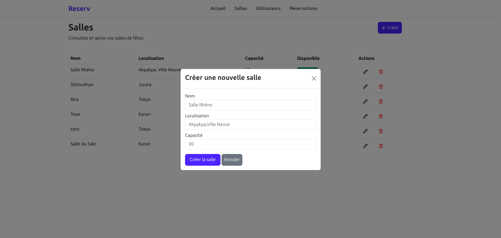
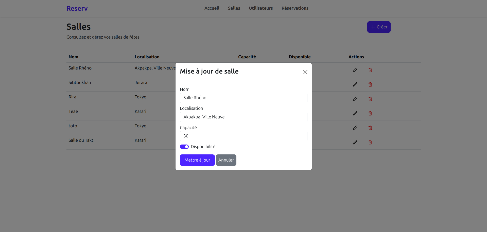
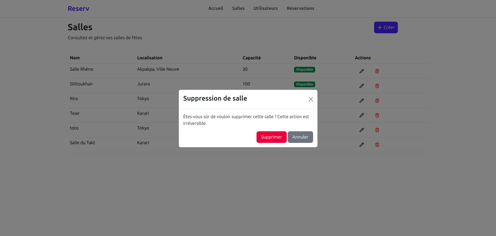

---

### Gestion des Réservations

Gérer toutes les réservations de salles avec gestion des dates et heures.

**Fonctionnalités :**
- Visualiser toutes les réservations avec les détails complets
- Créer de nouvelles réservations en :
  - Sélectionnant une salle disponible
  - Choisissant l'utilisateur effectuant la réservation
  - Définissant la date et l'heure (heure de début et de fin)
- Modifier les réservations existantes
- Supprimer des réservations
- **Note :** Seuls les utilisateurs avec le rôle "utilisateur" peuvent avoir des réservations (pas les administrateurs)

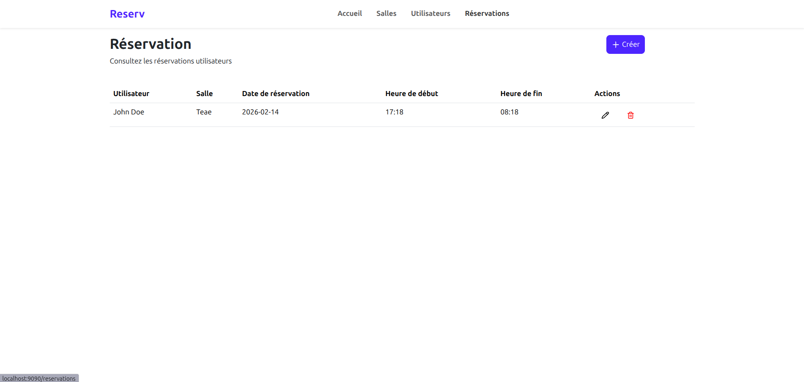
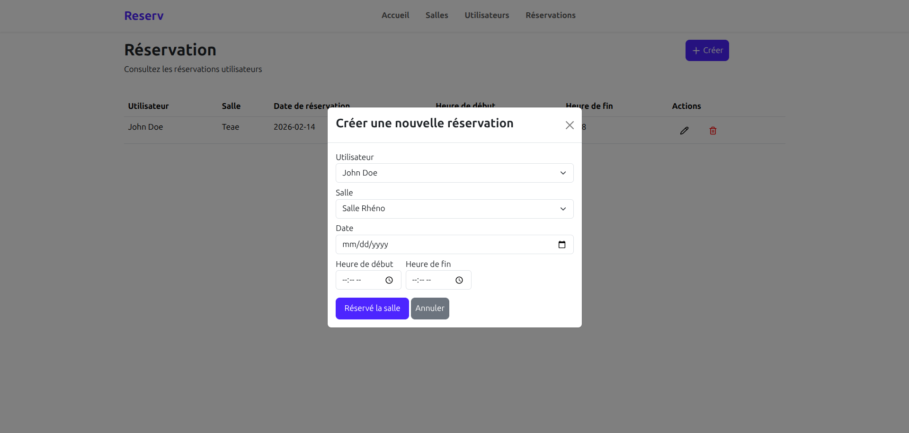
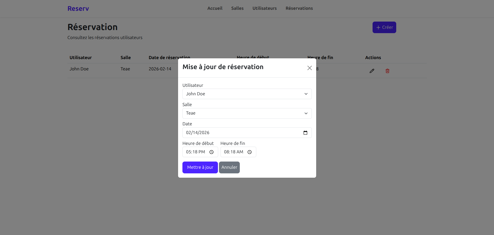
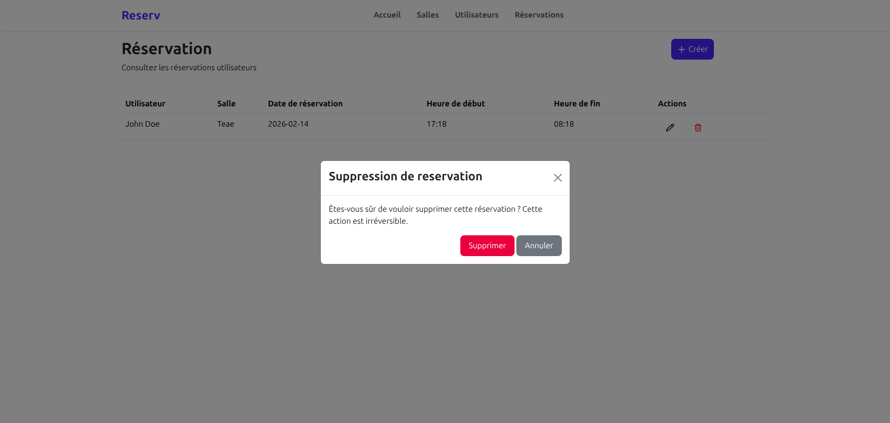

## Instructions d'Installation

### Configuration de la Base de Données

1. Créer une base de données PostgreSQL nommée `reservation`

2. Mettre à jour la configuration de la base de données dans `src/main/resources/application.properties` :
   ```properties
   spring.datasource.url=jdbc:postgresql://localhost:5432/reservation
   spring.datasource.username=VOTRE_NOM_UTILISATEUR
   spring.datasource.password=VOTRE_MOT_DE_PASSE
   ```

3. Remplacer `VOTRE_NOM_UTILISATEUR` et `VOTRE_MOT_DE_PASSE` par vos identifiants PostgreSQL.

## Exécution de l'Application

Accéder à l'application dans votre navigateur :
   ```
   http://localhost:9090
   ```

Naviguer dans l'application :
   - Page d'accueil : `http://localhost:9090/`
   - Utilisateurs : `http://localhost:9090/utilisateurs`
   - Salles : `http://localhost:9090/salles`
   - Réservations : `http://localhost:9090/reservations`

## Configuration du Projet

L'application s'exécute sur le port **9090** par défaut. Vous pouvez modifier cela dans `application.properties` :
```properties
server.port=9090
```